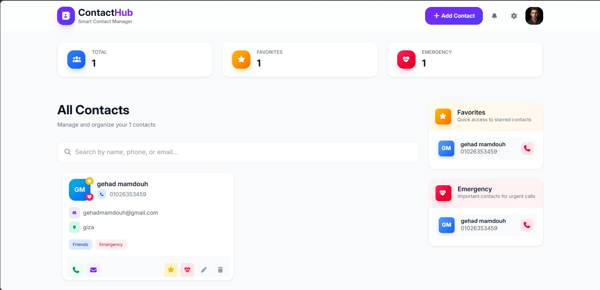
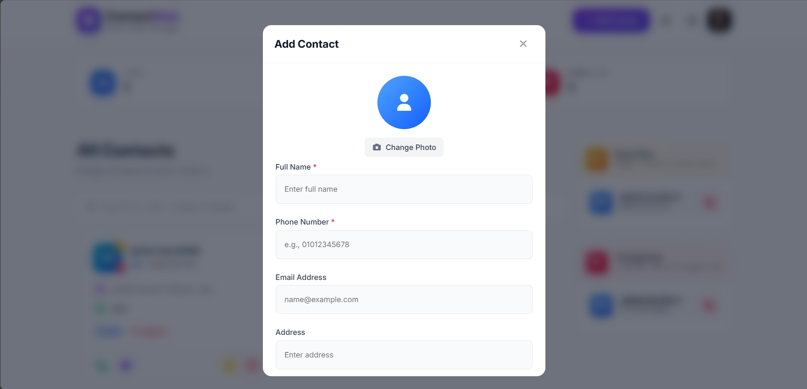
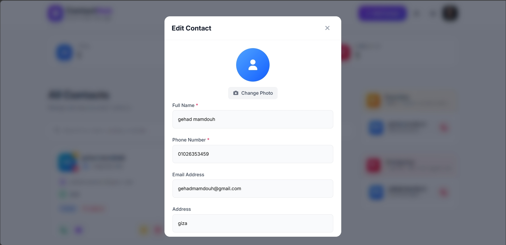
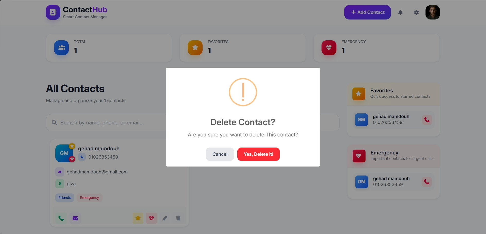

# ContactHub

A responsive contact management application that allows users to easily organize, manage, and interact with their contacts.

## Live Demo

(https://gehhaad.github.io/ContactHubProject/)

## Overview

ContactHub is a user-friendly contact management application designed to make it easy to organize and manage personal contacts in one place.

Users can add new contacts, update existing information, delete contacts, search for specific contacts, and manage a list of favorite contacts.

The application also provides quick actions for calling or emailing contacts directly from the interface.

## Features

- Add new contacts
- Update existing contacts
- Delete contacts
- Search contacts by name
- Search contacts by phone number
- Search contacts by email
- Add contacts to Favorites
- Remove contacts from Favorites
- Call contacts directly using `tel:`
- Send emails directly using `mailto:`
- Form validation before adding or updating contacts
- Persistent data using LocalStorage
- Confirmation alerts before deleting contacts
- Success alerts after adding or updating contacts
- Responsive design for different screen sizes

## Contact Management

### Add Contact

Users can add a new contact by opening the Add Contact form.

The contact form collects the required information and validates the entered data before saving it.

### Update Contact

Existing contacts can be edited and updated whenever their information needs to be changed.

### Delete Contact

Users can delete contacts from the application.

Before permanently deleting a contact, a confirmation alert is displayed to prevent accidental deletion.

### Search Contacts

The application provides contact search functionality.

Users can search for contacts using:

- Name
- Phone number
- Email address

## Favorites

Users can manage their favorite contacts by adding or removing contacts from the Favorites list.

This makes frequently used contacts easier to access.

## Contact Actions

Each contact provides quick action buttons for communication.

### Phone

The phone button uses the `tel:` URL scheme to start a phone call using the user's device.

### Email

The email button uses the `mailto:` URL scheme to open the user's default email application.

## Validation

The application validates contact information before saving it.

Validation helps ensure that users enter valid and correctly formatted data.

## LocalStorage

Contact data is stored using the browser's LocalStorage.

This allows the application to preserve contacts even after:

- Refreshing the page
- Closing and reopening the browser
- Navigating away and returning to the application

The stored data is loaded automatically when the application starts.

## Alerts & Notifications

The application uses SweetAlert2 to provide a better user experience when performing actions.

Alerts are displayed when:

- A contact is successfully added
- A contact is successfully updated
- A contact is about to be deleted
- A contact is successfully deleted
- An action requires user confirmation

## Responsive Design

The application is designed to work across different screen sizes.

Responsive behavior is implemented using:

- Bootstrap responsive utilities
- CSS Media Queries

The layout adapts to:

- Desktop screens
- Tablets
- Mobile devices

## Technologies Used

- HTML5
- CSS3
- Bootstrap
- JavaScript
- CSS Media Queries
- LocalStorage
- SweetAlert2

## Screenshots

### Contact Management


### Add Contact


### Update Contact


### Delete Contact


## Project Structure

```text
ContactHubProject/
│
├── css/
│   └── all.min.css
│   └── bootstrap.min.css
│   └── index_style.css
│   └── media_style.css
│
├── js/
│   └── bootstrap.bundle.min.js
│   └── index.js
│
├── images/
│   └── images of project
│
├── screenshots/
│   └── screenshots of project
│
├── webfonts/
│   └── fonts of project
│
└── index.html
│
└── README.md
